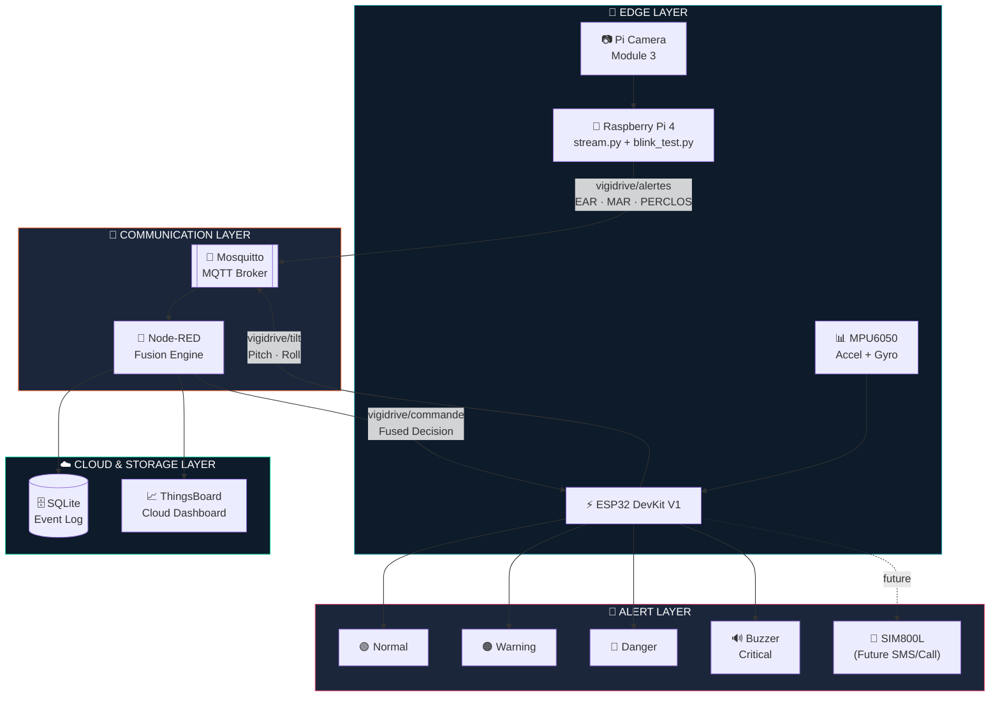
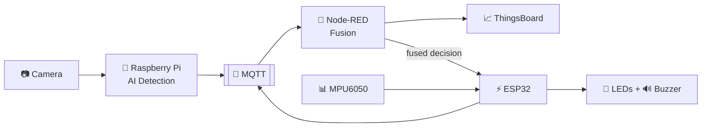
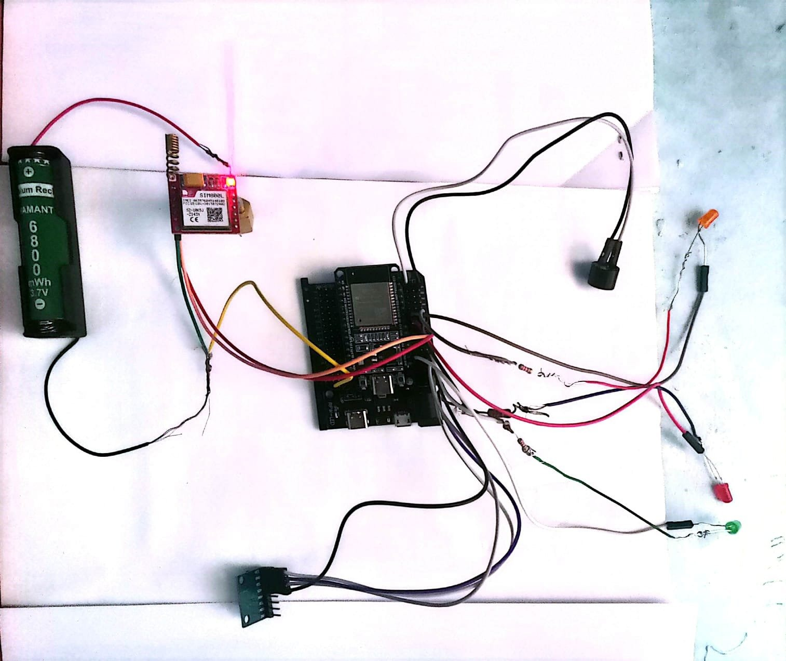
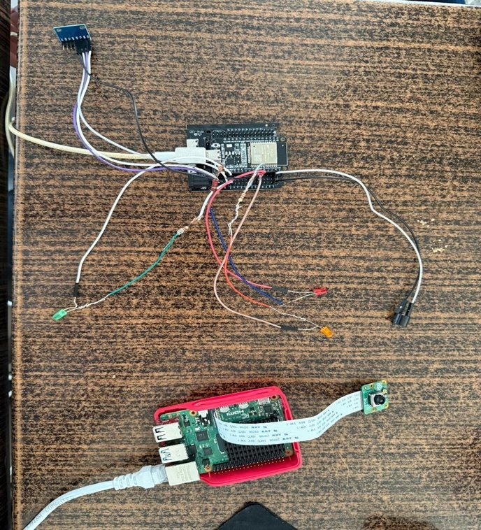
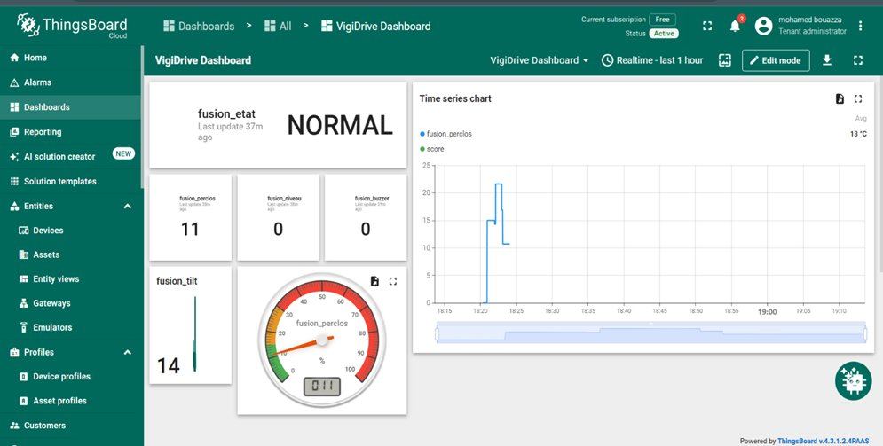
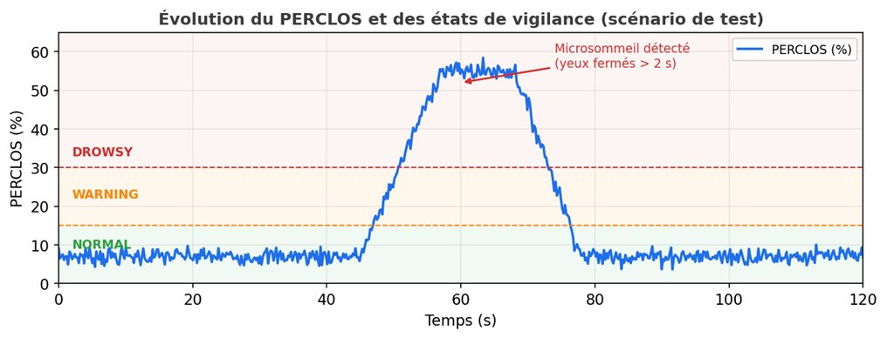

<div align="center">

# 🚗 VigiDrive AI

### Intelligent Driver Drowsiness Detection & Vigilance Monitoring System
##### Powered by Computer Vision, Edge AI, and IoT Sensor Fusion

<br/>


<br/>

**A hybrid Edge-AI + IoT system that watches the road so the driver doesn't have to fight fatigue alone.**

[Overview](#-project-overview) •
[Architecture](#-system-architecture) •
[AI Engine](#-ai-detection-engine) •
[Installation](#%EF%B8%8F-installation--setup) •
[Screenshots](#-screenshots) •
[Roadmap](#-future-improvements)

</div>

<br/>

---

## 📋 Table of Contents

- [📖 Project Overview](#-project-overview)
- [✨ Key Features](#-key-features)
- [🏗️ System Architecture](#-system-architecture)
- [🧩 Hardware Components](#-hardware-components)
- [💻 Software Stack](#-software-stack)
- [🧠 AI Detection Engine](#-ai-detection-engine)
- [🔀 Node-RED Fusion Engine](#-node-red-fusion-engine)
- [🔄 Project Workflow](#-project-workflow)
- [⚙️ Installation & Setup](#%EF%B8%8F-installation--setup)
- [📸 Screenshots](#-screenshots)
- [📁 Repository Structure](#-repository-structure)
- [🛣️ Future Improvements](#%EF%B8%8F-future-improvements)
- [📜 License](#-license)
- [👤 Author](#-author)

---

## 📖 Project Overview

**VigiDrive AI** is a hybrid **Edge-AI** and **IoT** system engineered to detect driver fatigue and drowsiness **in real time**, with the ultimate goal of preventing road accidents caused by microsleep and loss of vigilance.

The system fuses two independent sensing modalities — **facial computer vision** and **inertial head-motion sensing** — into a single, robust vigilance score. It combines:

| Domain | Technology |
|:--|:--|
| 👁️ **Computer Vision** | Real-time eye & mouth landmark tracking via MediaPipe Face Mesh |
| 🧠 **Artificial Intelligence** | EAR / MAR / PERCLOS fatigue metrics with adaptive, self-calibrating thresholds |
| 🍓 **Edge Computing** | Raspberry Pi 4 for on-device video processing and inference |
| 🔌 **Embedded Systems** | ESP32 for motion sensing, actuation, and GSM connectivity |
| 📡 **IoT Messaging** | MQTT (Mosquitto) for lightweight, low-latency telemetry |
| 🔀 **Flow-Based Fusion** | Node-RED for multi-sensor decision fusion |
| ☁️ **Cloud Monitoring** | ThingsBoard for live dashboards & remote supervision |
| 🗄️ **Persistence** | SQLite for local event logging and historical analysis |
| 📶 **Emergency Comms** | SIM800L GSM module for future emergency SMS / calls |

> 💡 **In short:** a camera watches the driver's eyes and mouth, an IMU watches the driver's head, an edge AI engine fuses both signals into a single vigilance state, and that state drives visual/audible alerts locally **and** a live cloud dashboard remotely.

---

## ✨ Key Features

- 👁️ **Real-time eye closure & blink tracking** using 468-point MediaPipe Face Mesh landmarks
- 😮 **Yawn detection** via Mouth Aspect Ratio (MAR) analysis
- 📊 **PERCLOS-based fatigue scoring** over a rolling 60-second window
- 🎯 **Self-calibrating adaptive thresholds** — no manual tuning per driver
- 😴 **Multi-stage drowsiness classification**: blink → prolonged closure → microsleep → critical closure
- 🧭 **Head-tilt / nod detection** via MPU6050 accelerometer + gyroscope on ESP32
- 🔀 **Sensor fusion engine** in Node-RED combining vision + motion into one verdict
- 🚦 **Tiered visual & audible alerting**: Green → Orange → Red → Buzzer
- ☁️ **Live cloud dashboard** with real-time telemetry via ThingsBoard
- 🗄️ **Local event logging** in SQLite for offline analytics and post-incident review
- 📶 **GSM-ready architecture** for future automatic emergency notifications
- 🌐 **MJPEG live video streaming** over Flask for remote visual verification

---

## 🏗️ System Architecture

VigiDrive AI is organized into four cooperating layers — **Edge**, **Communication**, **Fusion/Cloud**, and **Alerting** — as shown below.



**Pipeline summary:**

1. The **Raspberry Pi 4** captures live video and runs two cooperating processes — an MJPEG streaming server (`stream.py`) and the AI fatigue-detection engine (`blink_test.py`).
2. The AI engine computes EAR, MAR, PERCLOS, blink/yawn counts, and microsleep/critical-closure flags, then publishes them over MQTT.
3. The **ESP32** independently reads the **MPU6050** and computes pitch, roll, and head-tilt severity, publishing it over MQTT as well.
4. **Node-RED** subscribes to both streams, performs **sensor fusion**, stores the result in **SQLite**, forwards telemetry to **ThingsBoard**, and sends the final fused command back to the ESP32.
5. The **ESP32** drives the **LED traffic-light** and **buzzer** according to the fused vigilance state, with **SIM800L** reserved for future emergency communication.

---

## 🧩 Hardware Components

<table>
<tr><th colspan="2">🖥️ Processing</th></tr>
<tr><td><b>Raspberry Pi 4</b></td><td>Edge AI inference, video streaming, MQTT publishing</td></tr>
<tr><td><b>ESP32 DevKit V1</b></td><td>IMU sensing, alert actuation, GSM interfacing</td></tr>
<tr><th colspan="2">👁️ Vision</th></tr>
<tr><td><b>Raspberry Pi Camera Module 3</b></td><td>Real-time driver face capture</td></tr>
<tr><th colspan="2">📊 Sensors</th></tr>
<tr><td><b>MPU6050</b></td><td>6-axis accelerometer + gyroscope for head pitch/roll/tilt</td></tr>
<tr><th colspan="2">📡 Communication</th></tr>
<tr><td><b>SIM800L GSM Module</b></td><td>Cellular connectivity for future SMS/call alerts</td></tr>
<tr><td><b>WiFi</b></td><td>Local network connectivity for Pi ↔ ESP32 ↔ Broker</td></tr>
<tr><td><b>MQTT</b></td><td>Lightweight publish/subscribe messaging backbone</td></tr>
<tr><th colspan="2">🚨 Alerting</th></tr>
<tr><td><b>🟢 Green LED</b></td><td>Normal vigilance state</td></tr>
<tr><td><b>🟠 Orange LED</b></td><td>Warning / early fatigue state</td></tr>
<tr><td><b>🔴 Red LED</b></td><td>Danger state</td></tr>
<tr><td><b>🔊 Active Buzzer</b></td><td>Critical state, immediate driver alert</td></tr>
<tr><th colspan="2">🔋 Power</th></tr>
<tr><td><b>18650 Lithium Battery</b></td><td>Portable power for the ESP32 sensor/alert node</td></tr>
</table>

---

## 💻 Software Stack

| Layer | Technology | Purpose |
|:--|:--|:--|
| 🐍 Language | **Python 3.9+** | AI engine & streaming server |
| 👁️ Computer Vision | **OpenCV** | Frame capture, image processing, drawing overlays |
| 🧠 Face Landmarking | **MediaPipe Face Mesh** | 468-point facial landmark extraction |
| 🌐 Web Server | **Flask** | MJPEG live video streaming endpoint |
| 📡 Messaging | **MQTT / Mosquitto** | Pub/sub telemetry transport |
| 🔀 Flow Engine | **Node-RED** | Sensor fusion, routing, telemetry formatting |
| 🗄️ Database | **SQLite** | Local persistence of fusion events |
| ☁️ Cloud Platform | **ThingsBoard Cloud** | Remote real-time monitoring dashboard |
| ⚡ Firmware | **Arduino IDE / ESP32 Firmware** | IMU reading, fusion command handling, actuation |

---

## 🧠 AI Detection Engine

The AI engine (`blink_test.py`) runs entirely on-device on the Raspberry Pi, extracting facial landmarks every frame and deriving a set of fatigue indicators that are progressively combined into a single vigilance verdict.

### 1️⃣ EAR — Eye Aspect Ratio

EAR quantifies how open or closed an eye is, using six landmarks around the eye contour extracted from MediaPipe Face Mesh.

```
EAR = ( ‖p2 − p6‖ + ‖p3 − p5‖ ) / ( 2 × ‖p1 − p4‖ )
```

Where `p1`–`p6` are the eye-contour landmarks (horizontal corners and two vertical lid pairs). EAR stays roughly constant while the eye is open and drops sharply toward zero as the eyelid closes — making it the primary signal for blink, microsleep, and PERCLOS computation.

### 2️⃣ MAR — Mouth Aspect Ratio

MAR measures vertical mouth opening relative to mouth width, used to detect yawning.

```
MAR = ( ‖p2 − p10‖ + ‖p4 − p8‖ ) / ( 2 × ‖p0 − p6‖ )
```

Where `p0` and `p6` are the mouth corners and the remaining points trace the upper/lower lip contour. A sustained high MAR indicates a yawn in progress.

### 3️⃣ Adaptive Thresholding

Rather than relying on a single hard-coded EAR/MAR threshold (which varies wildly between individuals, eye shapes, and lighting conditions), VigiDrive AI **self-calibrates** during a short warm-up phase:

| Component | Role |
|:--|:--|
| **History Buffer** | A rolling window of recent EAR/MAR samples is continuously maintained |
| **Baseline** | The median of the buffer during normal open-eye operation establishes the personal "fully open" reference |
| **90th Percentile** | Used to detect the upper bound of natural EAR variability, filtering out noise spikes |
| **Median Percentile** | Used as a stable central reference, robust to outliers from blinks during calibration |
| **Adaptive Threshold** | Computed as an offset from the baseline (e.g. a fraction of the baseline EAR) so closure detection adapts automatically to each driver's eye geometry and the current lighting |

This removes the need for manual per-driver calibration and keeps detection accuracy stable across different users and cabin lighting conditions.

### 4️⃣ Blink Detection

A blink is registered when EAR drops below the adaptive threshold and recovers above it again within a short window — distinguishing a normal, healthy blink from the onset of prolonged closure.

### 5️⃣ Microsleep Detection

If the eyes remain below the adaptive EAR threshold **continuously for more than ~2 seconds**, the event is classified as a **microsleep** — a strong, specific indicator of involuntary sleep onset.

> 📊 This exact behavior is visible in the PERCLOS test chart below — note the annotated *"Microsommeil détecté (yeux fermés > 2 s)"* event during the simulated drowsy episode.

### 6️⃣ Prolonged Eye Closure

An intermediate stage between a blink and a microsleep — eyes closed for a shorter sustained duration than the microsleep threshold, used to trigger an **early warning** before the situation escalates.

### 7️⃣ Critical Eye Closure

The most severe closure-duration stage — eyes closed well beyond the microsleep threshold, triggering an **immediate critical alert** (buzzer + red LED) regardless of the current PERCLOS trend.

### 8️⃣ PERCLOS — Percentage of Eye Closure

PERCLOS is the gold-standard fatigue metric in drowsiness research. VigiDrive AI computes it as the **percentage of time, over the last rolling 60-second window, that the eyes were classified as closed**:

```
PERCLOS (%) = ( closed_frames / total_frames_in_last_60s ) × 100
```

| State | Threshold | Meaning |
|:--|:--|:--|
| 🟢 **NORMAL** | `< 15%` | Driver alert, normal blink behavior |
| 🟠 **WARNING** | `≥ 15%` | Early signs of fatigue accumulating |
| 🔴 **DROWSY** | `≥ 30%` | Significant fatigue, intervention required |

### 9️⃣ Yawn Detection

A yawn is registered when MAR exceeds its adaptive threshold continuously for a minimum duration (filtering out talking or brief mouth movement), incrementing the yawn counter, which feeds into the overall fatigue assessment alongside PERCLOS and microsleep events.

---

## 🔀 Node-RED Fusion Engine

Node-RED is the brain that reconciles **what the camera sees** with **what the IMU feels**, turning two independent sensor streams into one trustworthy vigilance verdict.

### 📡 MQTT Topics

| Topic | Publisher | Subscriber | Payload |
|:--|:--|:--|:--|
| `vigidrive/alertes` | Raspberry Pi (`blink_test.py`) | Node-RED | EAR, MAR, PERCLOS, blink count, yawn count, camera state |
| `vigidrive/tilt` | ESP32 | Node-RED | Pitch, roll, head-tilt level |
| `vigidrive/commande` | Node-RED | ESP32 | Final fused state → LED/buzzer command |

### ⚖️ Fusion Logic

Node-RED maintains the latest state from both the camera pipeline and the MPU6050 pipeline, then combines them into one of five global states, always escalating to the **more severe** of the two inputs:


| Fused State | Trigger Condition |
|:--|:--|
| 🟢 **NORMAL** | PERCLOS `< 15%` **and** head tilt within normal range |
| 🟠 **WARNING** | PERCLOS `≥ 15%` **or** moderate head tilt detected |
| 🟡 **FATIGUE** | Sustained warning condition **or** prolonged eye closure event |
| 🔴 **DANGER** | PERCLOS `≥ 30%` **or** microsleep event **or** severe head tilt |
| 🆘 **CRITICAL** | Critical eye closure event — immediate buzzer activation, overrides all other inputs |

### 🗄️ SQLite Storage

Every fusion cycle is appended to a local SQLite database with a timestamp, the camera metrics (EAR, MAR, PERCLOS), the tilt metrics (pitch, roll), and the resulting fused state — providing a persistent, queryable audit trail for offline analysis even when cloud connectivity is unavailable.

### ☁️ ThingsBoard Telemetry Formatter

Before forwarding data to the cloud, Node-RED reformats the fused payload into the structure **ThingsBoard expects** — a `ts` (epoch timestamp in milliseconds) field paired with a `values` object of key/value telemetry:

```json
{
  "ts": 1718800000000,
  "values": {
    "fusion_etat": "NORMAL",
    "fusion_perclos": 11,
    "fusion_niveau": 0,
    "fusion_buzzer": 0,
    "fusion_tilt": 14
  }
}
```

ThingsBoard requires this `ts` + `values` envelope so it can correctly timestamp and plot each telemetry key on its own time-series widget — this is exactly what powers the live dashboard shown in the [Screenshots](#-screenshots) section, where `fusion_etat`, `fusion_perclos`, `fusion_niveau`, `fusion_buzzer`, and `fusion_tilt` each appear as independent real-time widgets.

---

## 🔄 Project Workflow



1. **Camera → Raspberry Pi → AI Detection → MQTT → Node-RED → ThingsBoard**
2. **MPU6050 → ESP32 → MQTT → Node-RED**
3. **Node-RED → ESP32 → LEDs + Buzzer**

---

## ⚙️ Installation & Setup

> 🔧 Prerequisites: Raspberry Pi OS flashed and on the same network, ESP32 firmware already deployed via Arduino IDE, Mosquitto and Node-RED installed on the Pi, and a ThingsBoard Cloud account.

### Step 1 — Connect to the Raspberry Pi

```bash
ssh pi@192.168.137.6
```

### Step 2 — Start Camera Streaming

```bash
source ~/vigidrive_env/bin/activate
cd ~/vigidrive
python stream.py
```

### Step 3 — Start Fatigue Detection

```bash
ssh pi@192.168.137.6
source ~/mediapipe_env/bin/activate
python blink_test.py
```

### Step 4 — Start the MQTT Broker

```bash
sudo systemctl start mosquitto
sudo systemctl status mosquitto
```

### Step 5 — Start Node-RED

```bash
node-red-start
```

### Step 6 — Open the ThingsBoard Dashboard

Log in to your [ThingsBoard Cloud](https://thingsboard.cloud) instance and open the **VigiDrive Dashboard** to view live telemetry (`fusion_etat`, `fusion_perclos`, `fusion_niveau`, `fusion_buzzer`, `fusion_tilt`) as shown in the screenshots below.

---

## 📸 Screenshots

<table>
<tr>
<td width="50%">

**🔧 ESP32 + Sensor Node Wiring**
<br/>

<br/>
<sub>ESP32 DevKit wired to the MPU6050, traffic-light LEDs, active buzzer, SIM800L GSM module, and 18650 battery pack.</sub>

</td>
<td width="50%">

**🍓 Full Prototype Assembly**
<br/>

<br/>
<sub>Complete prototype: Raspberry Pi 4 with Camera Module 3 alongside the ESP32 sensor/alert node.</sub>

</td>
</tr>
<tr>
<td width="50%">

**☁️ ThingsBoard Live Dashboard**
<br/>

<br/>
<sub>Real-time cloud dashboard displaying fused vigilance state, PERCLOS, tilt, and buzzer status.</sub>

</td>
<td width="50%">

**📊 PERCLOS Evolution Chart**
<br/>

<br/>
<sub>PERCLOS over a 120s test scenario, crossing into the DROWSY zone with a detected microsleep event (eyes closed > 2s).</sub>

</td>
</tr>
</table>

---

## 📁 Repository Structure

```
VigiDrive-AI/
│
├── 📜 stream.py                  # Flask MJPEG live video streaming server
├── 📜 blink_test.py              # Core AI fatigue detection engine (EAR/MAR/PERCLOS)
│
├── 📂 esp32/                     # ESP32 firmware (Arduino)
│   ├── vigidrive_esp32.ino       # MPU6050 reading, MQTT pub/sub, LED & buzzer control
│   └── config.h                  # WiFi / MQTT / pin configuration
│
├── 📂 node-red/                  # Node-RED fusion engine
│   ├── flows.json                # Exported sensor fusion flow
│   └── thingsboard_formatter.js  # ts + values telemetry formatter function node
│
├── 📂 docs/                      # Documentation assets
│   ├── 🖼️ prototype.jpg
│   ├── 🖼️ dashboard.png
│   ├── 🖼️ perclos_chart.png
│   └── 🖼️ esp32_setup.jpg
│
├── 📂 database/                  # SQLite fusion event logs
│   └── vigidrive.db
│
├── 📜 requirements.txt           # Python dependencies
├── 📜 LICENSE                    # MIT License
└── 📜 README.md                  # You are here
```

---

## 🛣️ Future Improvements

- [ ] 🛰️ **GPS Integration** — geolocate critical fatigue events in real time
- [ ] 📩 **Automatic Emergency SMS** — activate the SIM800L module for instant alerts to emergency contacts
- [ ] 📞 **Automatic Emergency Call** — escalate critical states to a direct phone call
- [ ] 🪪 **Face Recognition** — driver identification for personalized fatigue baselines
- [ ] 👤 **Multi-Driver Profiles** — store and recall calibration data per registered driver
- [ ] ☁️ **Cloud Analytics** — historical fatigue trend reports and fleet-level insights
- [ ] 📱 **Mobile Application** — companion app for live monitoring and notifications
- [ ] 🤖 **ML-Based Fatigue Prediction** — predictive modeling ahead of overt drowsiness symptoms

---

## 📜 License

This project is distributed under the **MIT License**.

```
MIT License

Copyright (c) 2026 Mohamed Bouazza

Permission is hereby granted, free of charge, to any person obtaining a copy
of this software and associated documentation files (the "Software"), to deal
in the Software without restriction, including without limitation the rights
to use, copy, modify, merge, publish, distribute, sublicense, and/or sell
copies of the Software, and to permit persons to whom the Software is
furnished to do so, subject to the following conditions:

The above copyright notice and this permission notice shall be included in all
copies or substantial portions of the Software.

THE SOFTWARE IS PROVIDED "AS IS", WITHOUT WARRANTY OF ANY KIND, EXPRESS OR
IMPLIED, INCLUDING BUT NOT LIMITED TO THE WARRANTIES OF MERCHANTABILITY,
FITNESS FOR A PARTICULAR PURPOSE AND NONINFRINGEMENT. IN NO EVENT SHALL THE
AUTHORS OR COPYRIGHT HOLDERS BE LIABLE FOR ANY CLAIM, DAMAGES OR OTHER
LIABILITY, WHETHER IN AN ACTION OF CONTRACT, TORT OR OTHERWISE, ARISING FROM,
OUT OF OR IN CONNECTION WITH THE SOFTWARE OR THE USE OR OTHER DEALINGS IN THE
SOFTWARE.
```

See the [LICENSE](LICENSE) file for full details.

---

## 👤 Author

<div align="center">

**Mohamed Bouazza**

*Master's Student — Artificial Intelligence and IoT*

[](#)
[](#)
[](#)

<sub>Replace the badge links above with your actual GitHub, LinkedIn, and email addresses.</sub>

</div>

<br/>

<div align="center">

⭐ **If this project helped you, consider giving it a star!** ⭐

*Built with 🧠 AI, 🔧 IoT, and a genuine commitment to road safety.*

</div>
